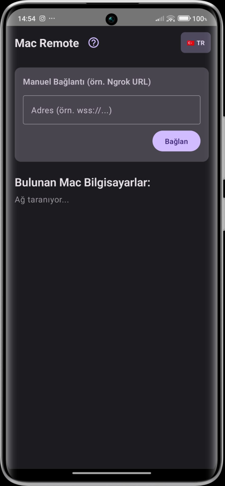
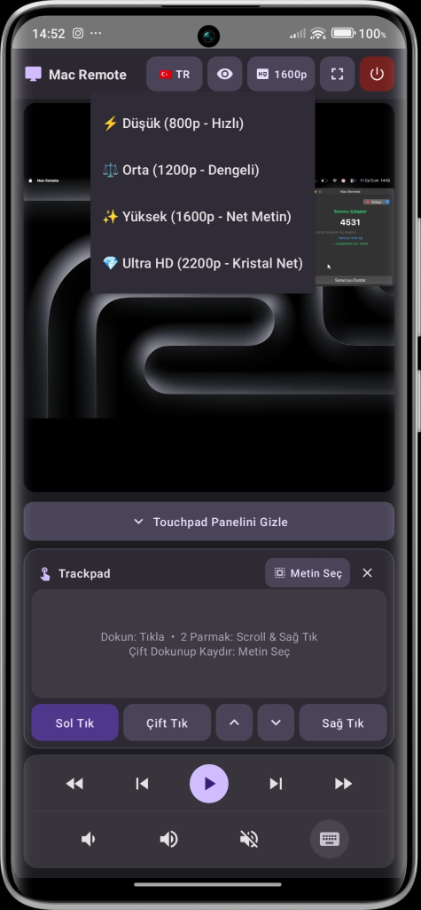
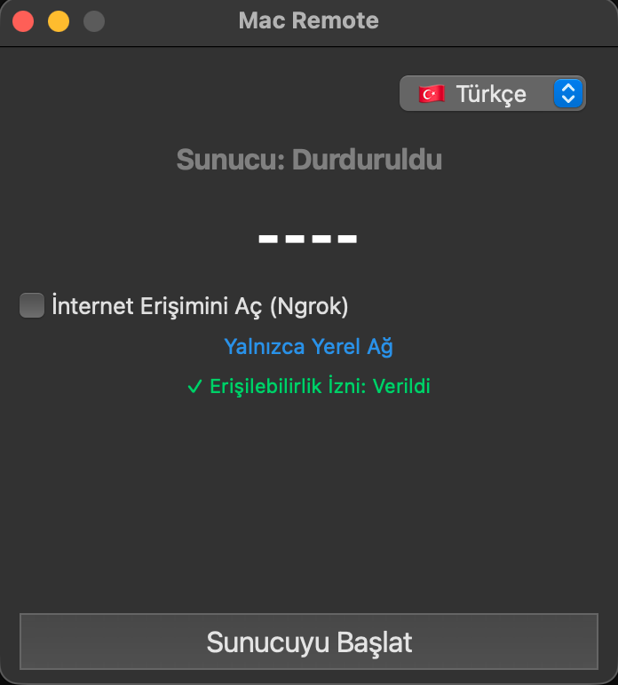
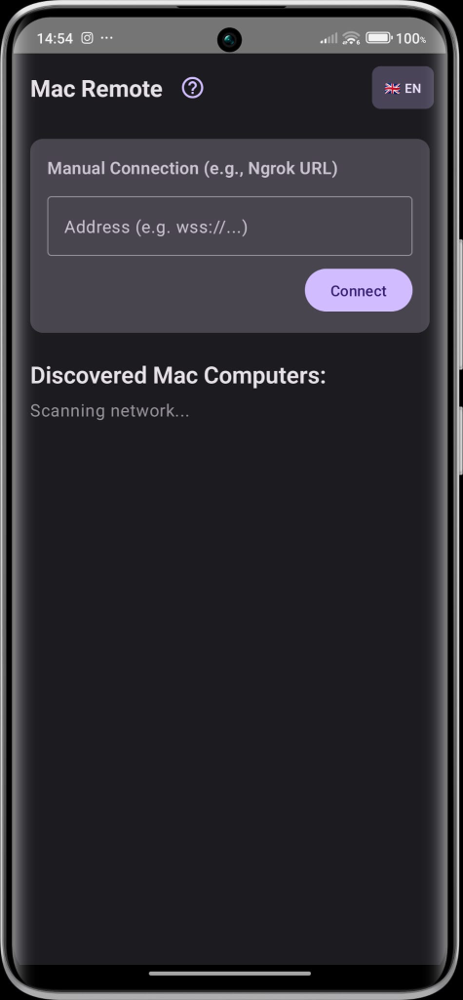
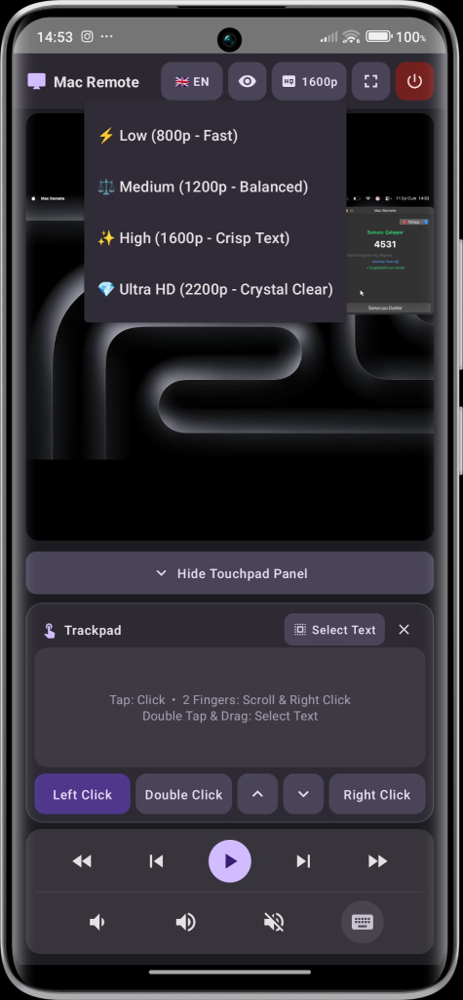
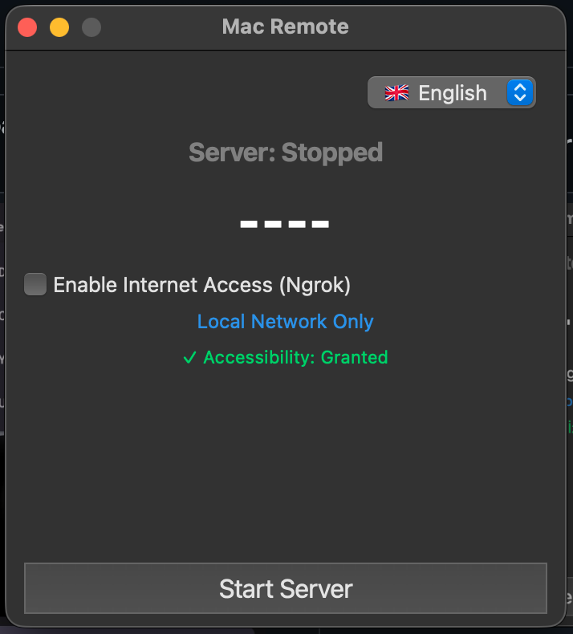

<div align="center">

# 🍎 Mac Remote

### Android Cihazınızdan Mac'iniz için Ultra Düşük Gecikmeli Kablosuz Trackpad, Klavye & Canlı Ekran Yansıtıcı

<p align="center">
  <a href="README.md"><b>🇬🇧 English</b></a> •
  <a href="README.tr.md"><b>🇹🇷 Türkçe</b></a>
</p>

[](https://github.com/ibrahimtemur/mac-remote/releases)
[](LICENSE)
[](https://github.com/ibrahimtemur/mac-remote/actions/workflows/build.yml)
[](https://github.com/ibrahimtemur/mac-remote)
[](https://github.com/ibrahimtemur/mac-remote/wiki)

<br/>

Android akıllı telefonunuzu veya tabletinizi; hem Yerel Wi-Fi (LAN) hem de İnternet (WAN) üzerinden macOS için yüksek hassasiyetli, donanım düzeyinde bir kablosuz trackpad'e, medya kumandasına, klavyeye ve kristal netliğinde canlı ekran yansıtıcısına dönüştürün.

[Özellikler](#-öne-çıkan-özellikler) • [Nasıl Çalışır](#-mimari--nasıl-çalışır) • [Kurulum](#-kurulum) • [Geliştirici Rehberi](#-geliştirici-rehberi-kaynak-koddan-derleme) • [Güvenlik](#-güvenlik) • [Wiki](https://github.com/ibrahimtemur/mac-remote/wiki)

</div>

---

## 📸 Ekran Görüntüleri

<div align="center">
  <h3>🇹🇷 Türkçe Arayüz</h3>
  <table>
    <tr>
      <td align="center"><b>1. Android Cihaz Keşfi & Bağlantı</b></td>
      <td align="center"><b>2. Trackpad, Canlı Ekran & Kalite</b></td>
      <td align="center"><b>3. macOS Sunucu Kontrol Paneli</b></td>
    </tr>
    <tr>
      <td align="center" valign="top"></td>
      <td align="center" valign="top"></td>
      <td align="center" valign="top"></td>
    </tr>
  </table>

  <h3>🇬🇧 English Interface</h3>
  <table>
    <tr>
      <td align="center"><b>1. Android Discovery & Pairing</b></td>
      <td align="center"><b>2. Trackpad, Mirror & Quality Tiers</b></td>
      <td align="center"><b>3. macOS Server Control Panel</b></td>
    </tr>
    <tr>
      <td align="center" valign="top"></td>
      <td align="center" valign="top"></td>
      <td align="center" valign="top"></td>
    </tr>
  </table>
</div>

---

## ✨ Öne Çıkan Özellikler

- 🖱️ **Donanım Düzeyinde Trackpad Emülasyonu:**
  - **Pürüzsüz İmleç Hareketi:** Alt piksel hassasiyetinde macOS CoreGraphics sentetik olay gönderimi.
  - **Doğal Çoklu Dokunma (Multi-Touch) Hareketleri:** Tek parmakla dokunma (sol tık), uzun basma veya çift parmakla dokunma (sağ tık) ve iki parmakla akıcı kaydırma (dikey & yatay).
  - **Metin Seçimi ve Sürükle-Bırak:** Çift dokunup sürükleme hareketi veya özel **"Metin Seç"** butonu ile yerel `kCGEventLeftMouseDragged` desteği.
  - **Dock ve Etkin Köşeler:** macOS Dock'u ve Mission Control / Etkin Köşeleri rahatça tetikleyen ivme kontrollü imleç mekanizması.
- 📺 **Dinamik Gerçek Zamanlı Ekran Yansıtma:**
  - Yerel macOS ScreenCapture API (`mss`) destekli ultra hızlı JPEG kare akışı.
  - **4 Farklı Çözünürlük Seviyesi:** Çalışma anında tek tıkla geçiş: **800p** (Hızlı / Az Veri), **1200p** (Dengeli), **1600p** (Net Metin / Kod Yazımı) ve **2200p** (Ultra HD Kristal Netlik).
  - Yüzen touchpad çekmeceli, tam ekran ve otomatik dönen yatay görünüm.
  - Canlı önizleme üzerinde imleç görünürlüğü açma/kapatma anahtarı.
- 🎵 **Medya ve Sistem Kontrol Çubuğu:**
  - Oynat/Durdur, Sonraki Parça, Önceki Parça.
  - Medya ve video oynatıcılar için 10 saniye ileri ve 10 saniye geri sarma.
  - Yerel macOS sistem ses seviyesi tuşları (Ses Aç, Ses Kıs, Sessize Al).
- ⌨️ **Genişletilebilir Sanal Klavye:**
  - Hızlı yardımcı tuşlar içeren entegre yumuşak klavye: `␣ Space`, `⌫ Backspace`, `⏎ Enter` ve `Esc`.
  - Harf tekrarı hatası olmayan, tek vuruşlu doğrudan metin iletimi.
- 🌐 **Sıfır Yapılandırmalı Ağ & Uzaktan Erişim:**
  - **Yerel Ağ (LAN):** mDNS / Zeroconf (`_macremote._tcp.local.`) ile Mac'i otomatik bulma.
  - **İnternet Erişimi (WAN):** Entegre Ngrok şifreli TLS tüneli — modemden port açmaya gerek kalmadan dünyanın her yerinden Mac'inize bağlanın.
  - **Dinamik 4 Haneli PIN Güvenliği:** Hızlı ve kurcalamaya karşı korumalı eşleştirme doğrulaması.
- 🌍 **Tam İki Dilli Arayüz:**
  - Hem macOS hem Android arayüzünde tek tıkla **Türkçe 🇹🇷** ve **İngilizce 🇬🇧** dil desteği.
  - Dil tercihi cihaz hafızasında kalıcı olarak saklanır.

---

## 🏗️ Mimari & Nasıl Çalışır?

```
┌───────────────────────────┐                     ┌───────────────────────────┐
│     Android İstemcisi     │                     │       macOS Sunucusu      │
│  (Kotlin/Jetpack Compose) │                     │     (Python 3.9+/PyQt6)   │
├───────────────────────────┤                     ├───────────────────────────┤
│ • NsdManager (mDNS)       │ <── Otomatik Bul ── │ • Zeroconf Yayıncısı      │
│ • OkHttp WebSocket Client │                     │ • Asyncio WebSocket Server│
│ • Compose Surface Canvas  │ ── JSON Komutları ─>│ • CoreGraphics (Quartz)   │
│ • Yerel Dokunma & Haptik  │ <── JPEG Kareleri ──│ • Yerel 'mss' Yakalayıcı  │
└───────────────────────────┘                     └───────────────────────────┘
```

1. **Keşif ve Eşleştirme:**
   - macOS sunucusu başladığında, Zeroconf (`_macremote._tcp.local.`) aracılığıyla yerel ağa varlığını yayınlar.
   - Android uygulaması, Android'in `NsdManager` API'sini kullanarak Mac'i saniyeler içinde otomatik olarak bulur.
   - İstemci, Mac ekranında beliren 4 haneli PIN'i içeren bir yetkilendirme el sıkışması gönderir.
2. **Girdi Enjeksiyonu:**
   - Hareket ve dokunma olayları düşük gecikmeli JSON WebSocket paketleri üzerinden iletilir.
   - Sunucu bunları macOS CoreGraphics Quartz olaylarına dönüştürür (`kCGHIDEventTap` seviyesinde `CGEventPost`), böylece gerçek donanım seviyesinde kontrol sağlanır.
3. **Ekran Akışı:**
   - Ekran kareleri seçilen çözünürlükte yakalanır, JPEG formatında sıkıştırılır ve GPU üzerinde doğrudan çizilmek üzere ikili WebSocket kareleri olarak telefona aktarılır.

---

## 📥 Kurulum

### 🍏 macOS (Sunucu)
1. [Sürümler (Releases)](https://github.com/ibrahimtemur/mac-remote/releases) sayfasına gidin ve en son `MacRemote-macOS.zip` arşivini indirin.
2. Arşivi açın ve **Mac Remote.app** uygulamasını `/Applications` (Uygulamalar) klasörünüze sürükleyin.
3. **Önemli Erişilebilirlik İzni:**
   - **Sistem Ayarları** > **Gizlilik ve Güvenlik** > **Erişilebilirlik** bölümünü açın.
   - **Mac Remote** seçeneğinin açık olduğundan emin olun. *(İmleç ve klavye simülasyonu için zorunludur).*
4. **Mac Remote** uygulamasını açın, **Sunucuyu Başlat** butonuna tıklayın ve ekrandaki 4 haneli PIN'i not edin.

### 🤖 Android (İstemci)
1. En son `MacRemote-Android.apk` dosyasını [Sürümler](https://github.com/ibrahimtemur/mac-remote/releases) sayfasından veya Google Play Kapalı Test kanalından indirin.
2. İndirilen `.apk` dosyasını açıp yükleyin.
3. **Mac Remote** uygulamasını açın, otomatik bulunan Mac'inizi seçin (veya IP / Ngrok URL'sini elle girin), 4 haneli PIN'i yazıp bağlanın.

---

## 💻 Geliştirici Rehberi (Kaynak Koddan Derleme)

### Depo Yapısı
```
├── mac-app/           # macOS masaüstü sunucu uygulaması (Python 3.9+, PyQt6, py2app)
├── android-app/       # Android istemci uygulaması (Kotlin, Jetpack Compose, Material 3)
├── docs/wiki/         # GitHub Wiki dokümantasyon seti
├── .github/           # GitHub Actions CI/CD iş akışları
└── scripts/           # Dağıtım ve otomasyon scriptleri
```

### 1. macOS Sunucusunu Derleme
```bash
# Depoyu klonlayın
git clone https://github.com/ibrahimtemur/mac-remote.git
cd mac-remote/mac-app

# Sanal ortam oluşturup bağımlılıkları yükleyin
python3 -m venv venv
source venv/bin/activate
pip install -r requirements.txt

# Geliştirme modunda çalıştırın
python3 gui.py

# Veya bağımsız macOS .app paketini oluşturun
python3 setup.py py2app
```

### 2. Android İstemcisini Derleme
```bash
cd mac-remote/android-app

# Debug APK derleme
./gradlew assembleDebug

# Release App Bundle (AAB) derleme
./gradlew bundleRelease
```

---

## 🔒 Güvenlik

Mac Remote sistem düzeyinde uzaktan erişim sağladığı için:
- Her oturum dinamik 4 haneli PIN doğrulaması ile korunur.
- Yerel Wi-Fi trafiği kesinlikle ev/ofis ağınızın dışına çıkmaz.
- Uzaktan (WAN) bağlantılar Ngrok TLS uç noktaları üzerinden şifreli HTTPS / WSS ile gerçekleştirilir.
- Sorumlu bildirim ilkeleri için [Güvenlik Politikamızı (SECURITY.md)](SECURITY.md) inceleyebilirsiniz.

---

## 🗺️ Yol Haritası

- [x] Çoklu dokunma hareketleri (Tıklama, Sağ Tık, 2 Parmak Kaydırma, Metin Seçimi)
- [x] Dinamik ekran kalitesi seviyeleri (800p - 2200p)
- [x] Ngrok ile dış ağdan uzaktan erişim
- [x] Android 16, tablet ve katlanabilir cihaz desteği
- [x] İki dilli arayüz (Türkçe & İngilizce)
- [ ] Çevrimdışı ortamlar için Bluetooth LE yedek bağlantısı
- [ ] macOS çoklu monitör seçici
- [ ] Android tarafında Biyometrik (Parmak İzi) PIN kilidi
- [ ] Mac'ten Android'e ses aktarımı

---

## 🤝 Katkıda Bulunma

Projeye katkıda bulunmak isteyen herkesi memnuniyetle karşılıyoruz! Lütfen bir Pull Request göndermeden önce [Katkı Yönergeleri (CONTRIBUTING.md)](CONTRIBUTING.md) ve [Davranış Kuralları (CODE_OF_CONDUCT.md)](CODE_OF_CONDUCT.md) belgelerini inceleyin.

---

## 📄 Lisans

Bu proje **MIT Lisansı** ile lisanslanmıştır - ayrıntılar için [LICENSE](LICENSE) dosyasına bakın.

---

<div align="center">
  <sub>Mac & Android arasında kusursuz bir deneyim için ❤️ ile geliştirildi.</sub>
</div>
