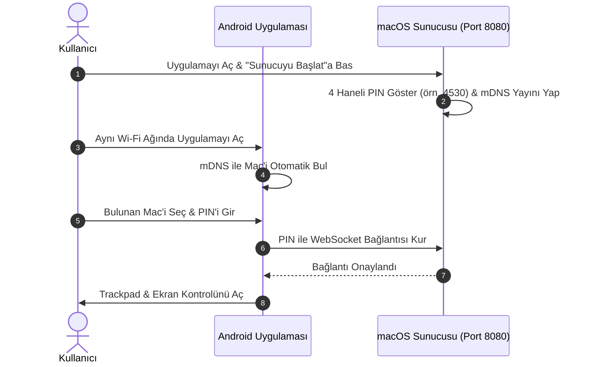

# 📦 Kurulum & Başlangıç Rehberi

  <a href="Installation-and-Setup"><b>🇬🇧 English</b></a> •
  <a href="Installation-and-Setup-TR"><b>🇹🇷 Türkçe</b></a>

Bu rehber, hem macOS sunucu uygulamasının hem de Android mobil istemcisinin kurulumunu ve ilk kez eşleştirilmesini adım adım açıklar.

---

## 1. macOS Sunucu Kurulumu

### Adım A: İndirme
1. [Mac Remote Sürümler](https://github.com/ibrahimtemur/mac-remote/releases) sayfasına gidin.
2. En güncel `MacRemote-macOS.zip` arşivini indirin.
3. Zip dosyasını açarak `Mac Remote.app` uygulamasını çıkarın.
4. `Mac Remote.app` dosyasını `/Applications` (Uygulamalar) klasörünüze taşıyın.

### Adım B: macOS Erişilebilirlik İzni (Zorunlu!)
macOS üzerinde fare hareketi, tıklamalar ve klavye tuş vuruşlarını simüle etmek Erişilebilirlik izni gerektirir:
1. **Mac Remote.app** uygulamasını açın.
2. Ekranda izin uyarısı gelirse **Sistem Ayarlarını Aç** butonuna basın.
3. **Sistem Ayarları > Gizlilik ve Güvenlik > Erişilebilirlik** bölümüne gidin.
4. **Mac Remote** yanındaki anahtarı açık konuma getirin.
5. İzin verildiğinde Mac Remote penceresindeki gösterge yeşile döner: `✓ Erişilebilirlik İzni: Verildi`.

> [!IMPORTANT]
> Erişilebilirlik izni verilmezse, imleç ve klavye kontrolleri macOS güvenlik ilkeleri tarafından engellenir.

---

## 2. Android İstemci Kurulumu

### Seçenek 1: Google Play Store (Kapalı Test / Herkese Açık)
1. Test grubuna katılın veya doğrudan Google Play'den indirin.
2. Uygulama güncellemeleri otomatik olarak Play Store üzerinden alınacaktır.

### Seçenek 2: Doğrudan APK İndirme (GitHub Releases)
1. Android cihazınızdan [GitHub Releases](https://github.com/ibrahimtemur/mac-remote/releases) sayfasına gidin ve `MacRemote-Android.apk` dosyasını indirin.
2. İndirilen `.apk` dosyasını açıp **Yükle** butonuna dokunun (Tarayıcınız izin isterse "Bilinmeyen uygulamaları yükle" iznini verin).

---

## 3. İlk Eşleştirme (Yerel Wi-Fi)

1. **Aynı Ağda Olun:** Mac'inizin ve telefonunuzun **aynı Wi-Fi ağına** bağlı olduğundan emin olun.
2. **Mac Sunucusunu Başlatın:** Mac Remote'u açıp **Sunucuyu Başlat** butonuna basın. Ekranda 4 haneli güvenlik PIN'i belirecektir.
3. **Android'i Açın:** Telefonunuzdaki Mac Remote uygulamasını açın.
4. **Otomatik Keşif:** Mac'iniz **Bulunan Mac Bilgisayarları** listesinde hemen görünecektir.
5. **Bağlanın:** Mac adına dokunun, ekrandaki 4 haneli PIN'i girin ve **Bağlan** butonuna basın!
