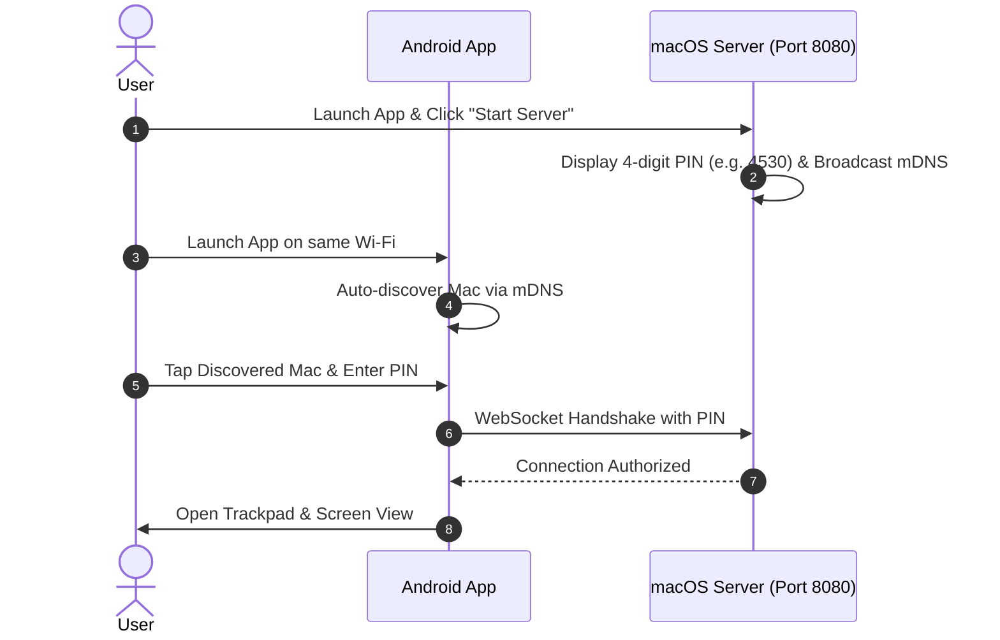

# 📦 Installation & Setup Guide

This guide walks you through installing both the macOS host server application and the Android mobile client, as well as pairing them for the first time.

---

## 1. macOS Server Installation

### Step A: Download
1. Head over to the [Mac Remote Releases](https://github.com/ibrahimtemur/mac-remote/releases) page.
2. Download the latest `MacRemote-macOS.zip` archive.
3. Double-click the zip archive to extract `Mac Remote.app`.
4. Move `Mac Remote.app` into your `/Applications` folder.

### Step B: macOS Accessibility Permissions (Crucial!)
In macOS, simulating mouse movement, clicks, and keyboard strokes requires Accessibility privileges:
1. Open **Mac Remote.app**.
2. If prompted, click **Open System Settings**.
3. Go to **System Settings > Privacy & Security > Accessibility**.
4. Enable the toggle next to **Mac Remote**.
5. Once enabled, the indicator in Mac Remote will turn green: `✓ Accessibility: Granted` (`✓ Erişilebilirlik İzni: Verildi`).

> [!IMPORTANT]
> If Accessibility permission is not granted, the cursor and keyboard simulations will be blocked by macOS security policies.

---

## 2. Android Client Installation

You have two options to install the Android app:

### Option 1: Google Play Store (Closed Testing / Public)
1. Join the test group or download directly from Google Play.
2. The app will receive automatic updates through the Play Store.

### Option 2: Direct APK Download (GitHub Releases)
1. On your Android device, download `MacRemote-Android.apk` from [GitHub Releases](https://github.com/ibrahimtemur/mac-remote/releases).
2. Open the downloaded `.apk` and tap **Install** (Allow "Install Unknown Apps" if requested by your browser).

---

## 3. Pairing for the First Time (Local Wi-Fi)

1. **Ensure same network:** Connect your Mac and your Android device to the **same Wi-Fi network**.
2. **Start macOS Server:** Open Mac Remote on your Mac and click **Start Server** (`Sunucuyu Başlat`). A 4-digit security PIN will appear on screen.
3. **Open Android App:** Launch Mac Remote on your phone.
4. **Auto-Discovery:** Your Mac will automatically appear under **Discovered Mac Computers**.
5. **Connect:** Tap on your Mac's name, enter the 4-digit PIN shown on your Mac, and tap **Connect**!
